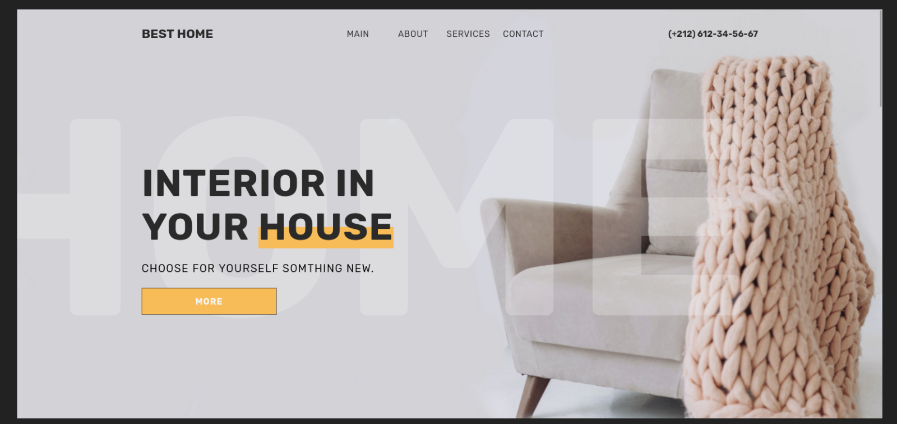

# Digital Agnecy [Viscalle] 

Transforme design to a responsive webpage with HTML, CSS and JavaScript.

## Table of contents

- [Overview](#overview)
  - [Links](#links)
- [My process](#my-process)
  - [Built with](#built-with)
  - [Learning](#learning)
- [Author](#author)

## Overview

### Links

- Solution URL: [Solution URL here](https://github.com/styrexx/best-home)
- Live Site URL: [Live site URL here](https://styrexx.github.io/best-home)

## My process

### Built with

- Semantic HTML5 markup
- CSS custom properties
- Flexbox
- JavaScript

### Learning

- background image
- Practex in flexbox and grid
- Practex in pseudo elemente `:after` and `:before`
- DOM

## Author

- Frontend Mentor - [Abdessamad](https://www.frontendmentor.io/profile/kop-left)
- github - [Abdessamad](https://www.github.com/styrexx)
